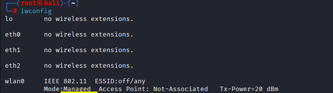
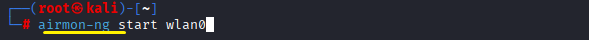
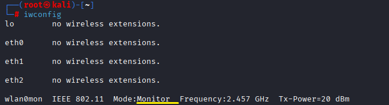
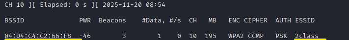
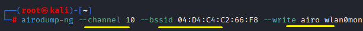
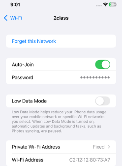
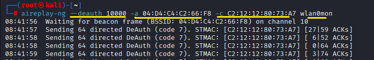

*Aireplay-ng 
 
Performing attacks utilizing packet injection as the primary function on a wireless network. 
무선 네트워크에 패킷 주입이 주된 기능으로 공격을 수행 
 
 

 
The wireless Wi-Fi adapter is currently in the default Managed Mode. 
현재 무선 wifi 어댑터가 managed 관리모드로 기본 상태입니다. 
 
 
 

 
Monitor mode is initiated using airmon-ng. 
This is the special mode designed to capture all wireless network traffic and inject new packets into the network. 

airmon-ng로 모니터 모드를 실행합니다.  
모든 무선네트워크를 캡처하고 새로운 패킷을 주입하기 위해 설계된 특수 모드입니다. 
 
 
 
 
 

 
After the transition to Monitor Mode, the attack is executed. 
모니터 모드로 변경한 후 공격을 실행합니다. 
 
 
 
 
 

 
Wireless network packets can be captured using airodump-ng. 
airodump-ng로 무선 네트워크 패킷을 잡을 수 있습니다. 
 
 
 
 

 
When the command is executed, targets are displayed. The object of the attack is the Wi-Fi(2class). 
명령을 실행하면 대상들이 나타납니다. 2class가 공격의 대상입니다. 와이파이 공유기입니다. 
 
 
 
 
 

 
To focus the capture on a specific target, 
the command is executed using the unique identifier (BSSID), the channel, a save file name, and the wireless interface 
* Why-특정하기 위해, 고유 식별자와 채널을 입력 후, 저장 파일 이름과 무선네트워크 wlan0mon으로 명령어를 실행합니다. 
 
 
 
 
 

 
Among the devices utilizing the Wi-Fi network named 2class, the specific target can be identified using its unique identifier. 
2class라는 와이파이를 사용하고 있는 기기 중에 고유 식별자로 대상을 특정할 수 있습니다. 
 
 

 
As packet injection has not commenced, smooth and uninterrupted internet service is maintained. 
아직 패킷을 주입하기 전이므로 인터넷을 원할하게 사용 가능한 상태입니다.
 
 
 

 
Packets are injected into a specific device utilizing aireplay-ng. 
This refers to the Deauthentication attack, which forcibly disconnects the client device from the Access Point (AP). 
Aireplay-ng를 이용해서 특정 기기에 패킷을 주입합니다. 
Deauthentication 디인증 공격으로 공유기(AP)로부터 강제 연결을 해제시키는 공격을 의미합니다.
 
 
 

Although the Wi-Fi connection was active, it was immediately disconnected the moment the packet was injected. 
현재 와이파이가 연결 중인데, 패킷을 주입하는 순간 바로 연결 해제되었습니다. 

 

