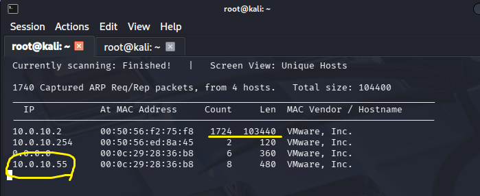
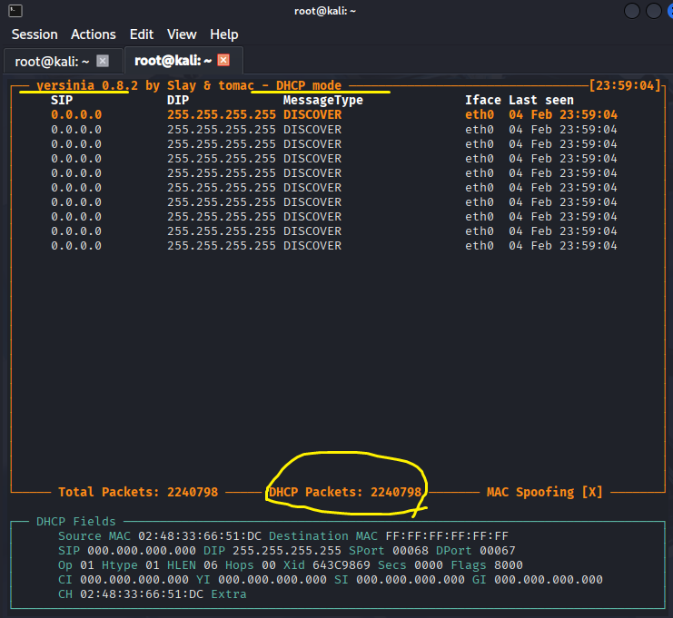
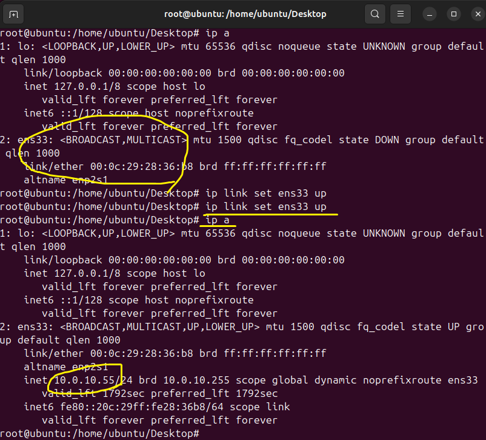
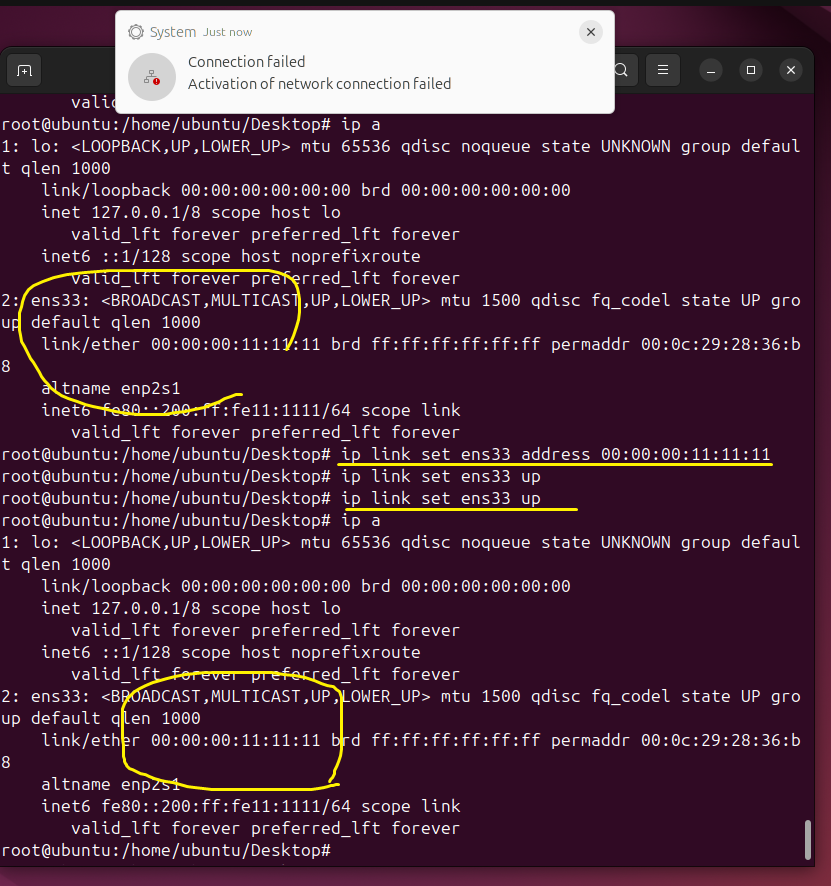
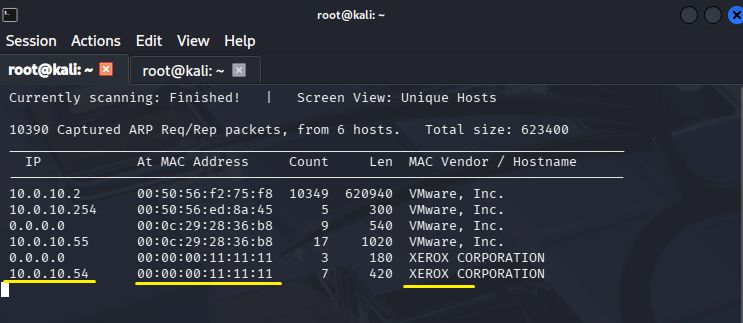
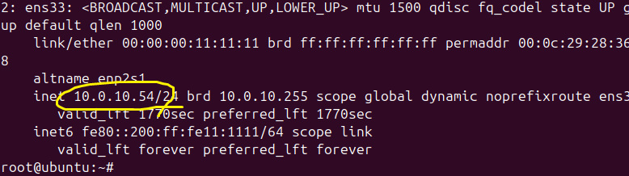

* Attack 
 
 
 

 
A broadcast attack will be conducted in a restricted network environment. The target IP address is 10.0.10.55. 
The gateway can be identified by examining the WHY-len and count values. 

브로드캐스트 공격으로, 제한된 네트워크 환경에서 진행하겠습니다. 공격 대상 IP는 10.0.10.55입니다. 
*WHY-len과 count의 숫자를 보고 게이트웨임을 알 수 있습니다. 
 
 
 
 
 
 

 
An attack can be performed using a Scapy script. 
however, there are limitations in execution speed when handling processes such as Offer–Request exchanges. 
Therefore, Yersinia, an automated tool that processes packets automatically according to the situation, will be used. 

scapy, 스크립트를 이용해 공격할 수 있지만, Offer-Request 처리 등 실행속도에 한계가 있습니다. 
*WHY-상황에 맞게 패킷을 자동으로 처리하는 자동화 프로그램 Yersinia를 이용하겠습니다.
 
 
 
 
 
 

 

When the network is activated while no IP address is assigned,  
an IP address should not be allocated and internet access should not be available. 
However, despite a large number of DHCP packets being transmitted, the IP address was assigned normally due to memory limitations. 

IP가 할당되어 있지 않은 상태에서 네트워크를 활성화시키면 IP를 할당받지 못하고 인터넷을 이용할 수 없어야 합니다. 
하지만, 많은 DHCP 패킷이 전송되고 있는 상태에서 메모리 때문에 IP가 정상적으로 할당되었습니다.
 
 
 
 
 
 
 

 

 
 
 
 
 
 

 

 
 
 
 
 
 

 
