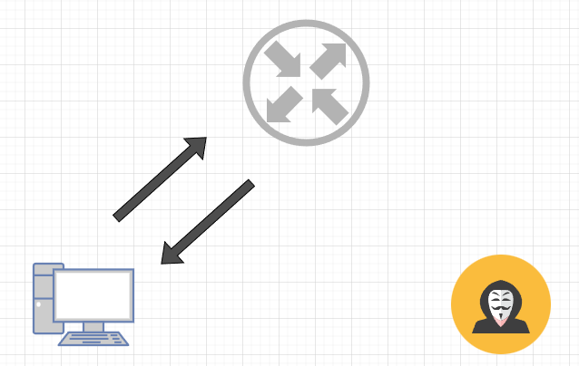
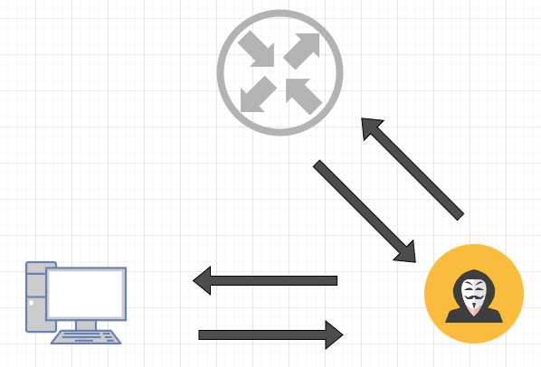
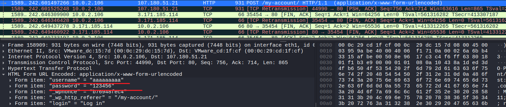

*arp spoofing 
 
 

 

이게 정상적인 통신 경로라고 하겠습니다. 
 
 
 
 

 

맨 인 더 미들(Man-in-the-Middle, MitM) 공격의 핵심으로  
공격자가 MAC 주소를 위조해 피해자와 게이트웨이의 양쪽 통신을 가로채 중간에서 감시하는 역할을합니다. 

 
 
 

   

왼쪽이 공격자 PC의 IP 오른쪽이 피해자 PC의 IP라고 하겠습니다. 

 

 

 

 

 

 

 

 

 

 

 

 

 
