*arp spoofing 
 
 

(Kali)

 

이게 정상적인 통신 경로라고 하겠습니다. 
 
 
 
 

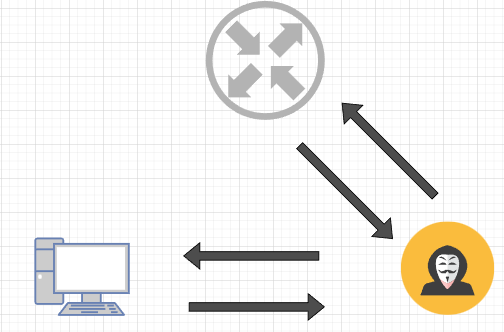 

맨 인 더 미들(Man-in-the-Middle, MitM) 공격의 핵심으로  
공격자가 MAC 주소를 위조해 피해자와 게이트웨이의 양쪽 통신을 가로채 중간에서 감시하는 역할을합니다. 

 
 
 

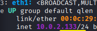 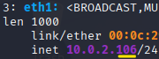  

왼쪽이 공격자 PC의 IP이고, 오른쪽이 피해자 PC의 IP입니다. 
 
 

 

netdiscover는 특정 네트워크 대역에서 IP와 MAC주소를 수집합니다. 
eth1 설정 후 10.0.2.0/24에서 네트워크를 탐색합니다. 
 
 

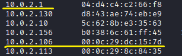 

보통 탐색했을 때, 가장 위에 나오는 10.0.2.1이 라우터 게이트웨이입니다. 
정해진 건 아니지만 MAC 주소옆에 MAC vendor를 보고 알 수 있습니다. 

 
 
 

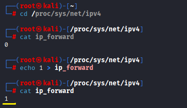 

기본 값이 ip 포워딩이 0으로 비활성화 되어있는데, 이걸 1로 활성화합니다. 
이로 인해 중간자에게 온 트래픽이 목적지로 끊기지 않게 보내게 됩니다. 
 
 
 

 
 

Arp spoofing 하기 전, 피해자PC와 중간자PC의 IP와 MAC주소입니다. 
 
 

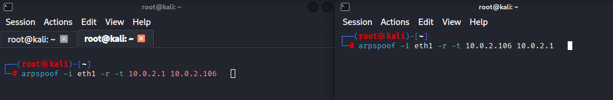 

이렇게 중간에서 양쪽으로 arp 패킷을 보냄으로써, 피해자PC에게는 라우터로, 라우터에게는 피해자 PC로 위장합니다. 
* -r : 양방향으로 실행해줍니다. 
 
 
 
 

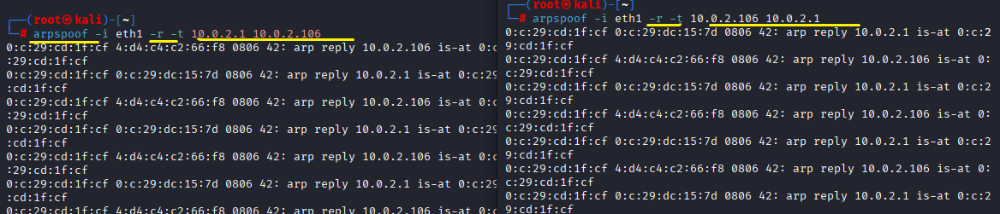 

양쪽에 신호를 보냅니다. 
 
 
 
 

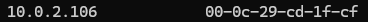 
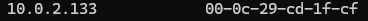 

ARP 패킷을 보내고 arp테이블 조회를 하면 피해자의 MAC주소는 중간자의 MAC주소로 위조되어 나옵니다. 이때 중간에서 모든 트래픽을 거쳐서 라우터로 이동하게 됩니다.
 
 
 
 

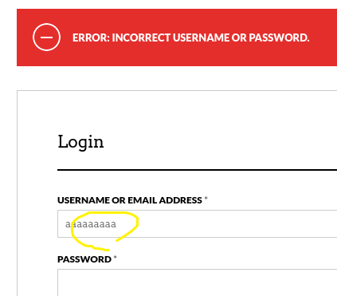 

HTTP로 이루어진 웹사이트에 로그인을 했을 때, 암호화 되어있지 않기 때문에 중간자는 패킷 감시로 로그인 정보를 전부알 수 있게 됩니다.
 
 
 
 

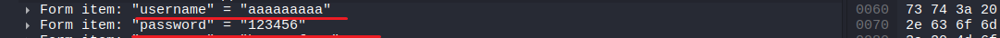 

wireshark를 통해 로그인 정보를 볼 수 있습니다.

