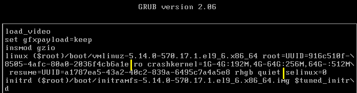
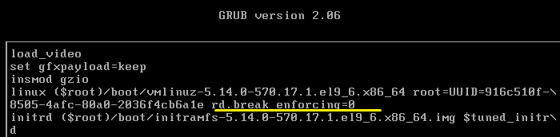
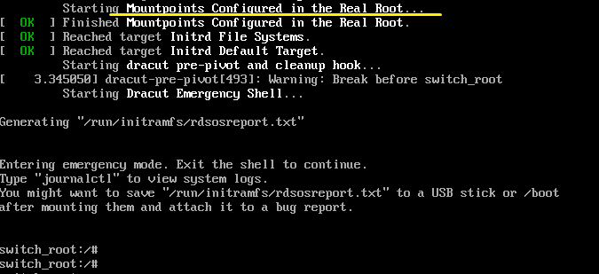
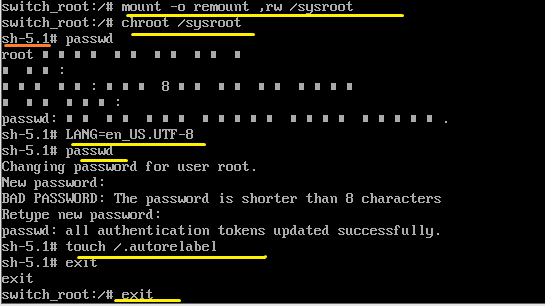

**booting 
 
 

1.BIOS (Basic Input/Output System) 
 
When the PC is powered on, the BIOS operates first. 
After checking the basic hardware status (ON-OFF), the boot device is selected and the first sector (512B, MBR) of that disk is loaded. 
The MBR contains information about the location of the bootloader. This is loaded into memory to execute the secondary boot program. 
PC를 켜면 먼저 바이오스가 작동합니다. 
기본적인 하드웨어의 상태(ON-OFF)를 확인 후, 부팅 장치를 선택하여 그 디스크의 첫 섹터 512B(MBR)를 로딩합니다. 
MBR에는 부트로더 위치 정보가 있습니다. 이를 메모리에 로딩해 2차 부팅 프로그램을 실행합니다 
 

BIOS stage: Hardware check → Boot device selection → MBR load → Bootloader load 
BIOS 단계 : 하드웨어 검사 → 부팅장치 선택 → MBR 로드 → 부트 로더로드 
 
 

2.부트 로더(GRUB) 
The open-source Linux kernel is loaded into memory. 
오픈 소스인 리눅스 커널을 메모리에 로딩합니다. 
 
 

3. 커널 초기화 단계 
The hardware connected to the system is prepared for use, and the kernel is initialized. Then, the 'first' process is created to start running services. 
시스템에 연결된 하드웨어를 사용 가능한 상태로 준비하고 커널을 초기화합니다. 이후 서비스 실행을 위해 '첫 번째' 프로세스를 생성합니다. 
 
 

4. Systemd 서비스 단계 
After systemd runs as the first process, core services and daemons are activated. 
Compatibility with the initial process, init, is still maintained. 
systemd가 첫 번째 프로세스로 실행된 후, 핵심 서비스와 데몬이 활성화됩니다. 
초기 프로세스인 init과의 호환성도 여전히 유지됩니다. 
 
init is the ancestor of all processes; in modern systems, it has been replaced by systemd. 
init = 모든 프로세스의 조상 역할, 현대는 systemed로 대체  
 
 
vi /etc/inittab 
init + runlevel = immediate change of system state 
init + 런레벨 = 시스템 상태 즉시 변경 
      (0 ~ 6)
init 0 = poweroff 
init 6 = reboot 

 
 

 

Login prompt screen → Boot process completed 
로그인 프롬포트 화면, 부팅 과정 완료 
 
 
 
 
 
 
 
 
 
 
 

* GRUB - root 암호 복구하기(Recovering the root password) 

At the bootloader screen above, quickly press e to enter edit mode. 
위의 부트로더 화면에서 신속하게 e를 눌러 편집모드로 전환해야 합니다. 

 
After entering edit mode like this, delete the highlighted yellow part. 
이렇게 편집모드로 전환되었고 노란색 부분을 삭제합니다. 
 
 

 
rd.break enforcing=0 disables the SELinux enforcement tool, meaning security is effectively turned off. 
rd.breck enforcing=0이 되는데, 보안 설정 도구 selinux를 강제 적용하지 않으므로, 보안 해제의 의미입니다. 
 
 

 
When restarting with Ctrl + x, this screen appears; it is the screen for recovering the root password. 
switch_root is a temporary recovery shell and the stage where control is handed over to the real root filesystem. 
Ctrl + x 로 재시작을 하면 이런 화면이 나오는데, root 암호 복구를 위한 화면입니다. 
switch root는 임시 복구용 쉘이며, 실제 루트 파일 시스템으로 전한하는 단계입니다. 
 
 

 
*Why-in the rd.break state the root filesystem (/sysroot) is read-only, switch it to read‑write mode. 
The current shell's root directory is changed to /sysroot, which means entering the real system environment. 
After resetting the password, create a file that causes SELinux to relabel the entire filesystem so it will be rechecked on next boot. 
*Why-rd.break상태에선 루트 파일시스템(/sysroot)읽기 전용이므로, 일기 및 쓰기 모드로 전환합니다. 
현재 쉘 루트 디렉터리를 /sysroot로 바꿔 실제 시스템 환경으로 들어가는 의미입니다. 
비밀번호 재설정 후에, Selinux가 모든 파일 시스템 재검사하도록 라벨을 다시 설정하도록 하는 파일을 만듭니다. exit -> reboot 

 
 

* 암호 복구 방어 (Bootloader Lock)
 
vi /etc/grub.d/00_header 
*Why-The script file that is read first when creating the bootloader configuration. 
*Why-부트로더 설정 생성시 가장 먼저 읽히는 스크립트 파일 
 
cat << EOF 
set superusers="mylinux" 
password mylinux 1234 
EOF 

It is saved in the corresponding script file. 
해당 스크립트 파일에 저장합니다. 

 
Command: grub2-mkconfig -o /boot/grub2/grub.cfg 
Once applied, a password prompt will appear when attempting to edit. 
적용하게 되면, 편집시에 비밀번호를 설정한 비밀번호를 물어봅니다. 

