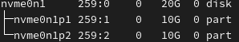
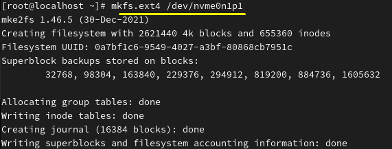
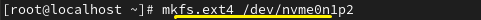
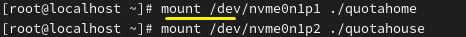
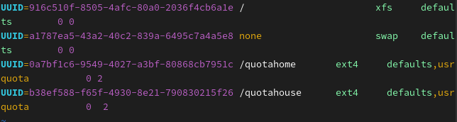
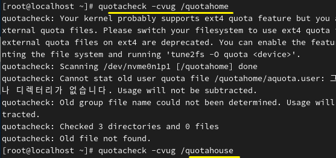
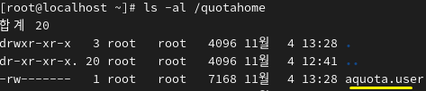
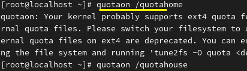
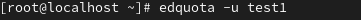
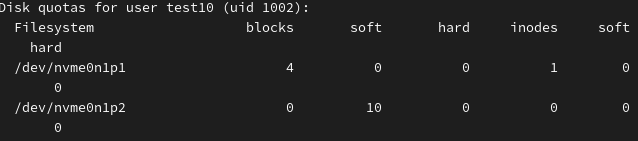

**Quota 
 
Disk Quota 
정해진 한도 
 

 
 

usrquota : 개별 사용자의 쿼터 제한할 수 있는 속성 
qrpquota : 개별 그룹의 쿼터 제한할 수 있는 속성 
 
 
 
 
This is the current disk status. 
현재 디스크 상태입니다.

Command : vi /etc/fstab 
 
An option must be added to the script to activate the quota function. 
해당 스크립트에 옵션을 추가해야 쿼터 기능이 활성화됩니다. 
 
 
 
 
The disk will be formatted before the quota is set. 
쿼터 설정하기 전에, 디스크 포맷을 먼저하겠습니다 

 
Disk format. 
디스크 포맷입니다. 
 

 
Mounts to each mount point. 
마운트 포인트에 각각 마운트합니다. 
 
 

 
It is configured according to individual user properties. 
개별 사용자 속성에 맞게 작성합니다 
 
 
 

 
The filesystem must be remounted since quota settings do not take effect right away. 
쿼터 속성을 설정 후 바로 적용되는 것이 아니기때문에, 파일 시스템을 다시 마운트합니다 
 
 
quotacheck: Creation of the quota database = 쿼터용 데이터베이스(aquota.user, aquota.group) 생성 

 

 
 
\The quota database file has been created. 
쿼터 데이터베이스 파일이 생성되었습니다.. 
 
 

quotaon : Activates the quota = 쿼터 기능 활성화 

 
 
 
 
 
edquota : Configures the quota = 쿼터 설정 

 

 

 
 
Command: The quota information can be viewed using the quota command. 
Command : quota를 사용하여 쿼터 정보를 볼 수 있습니다.

