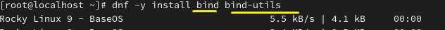
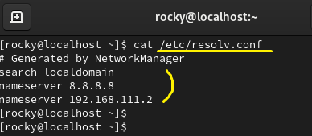
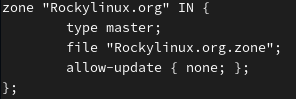

**DNS 
 
 

Forward :   Domain → IP 
Reverse :   IP → Domain 
 
 
A system that converts human-friendly website addresses into computer addresses (IP). 
사람이 기억하기 쉬운 웹사이트 주소를 컴퓨터의 주소(IP)로 바꿔주는 시스템 

 
 
 
 
 

 
bind : DNS 서비스를 제공하는 서버 구축 시 필요 
bind-utils : DNS 관련 문제 해결 및 정보 조회 ex) nslookup 
 
 
 
 

 
vi /etc/resolv.conf  DNS 서버 주소 저장소. 
시스템 네트워크 관리 도구에 의해 자동적으로 관리되므로 유동적입니다. 
 
nmcli con mod ens160 ipv4.dns 192.168.111.2 
수동으로 DNS 서버 주소를 설정합니다. 영구적 설정입니다. 

 
 
 
 
 

 
vi /etc/named.conf 
zone : 도메인의 목록 

 
 
 
 
 

* Example
 
Domain name structure 
도메인 작성 양식
 
 
 

zone "Koreabcd.com" IN { 
&nbsp;&nbsp;&nbsp;&nbsp;&nbsp;&nbsp;&nbsp;&nbsp;&nbsp;&nbsp;&nbsp;&nbsp;&nbsp;        type master; 
&nbsp;&nbsp;&nbsp;&nbsp;&nbsp;&nbsp;&nbsp;&nbsp;&nbsp;&nbsp;&nbsp;&nbsp;&nbsp;       file "Koreabcd.com.zone"; 
&nbsp;&nbsp;&nbsp;&nbsp;&nbsp;&nbsp;&nbsp;&nbsp;&nbsp;&nbsp;&nbsp;&nbsp;&nbsp;        allow-update { none; }; 
}; 
 

domain: Koreabcd.com 
typy masterthe main server managing a domain zone. 
typy master : 도메인 영역의 주 관리 서버 
