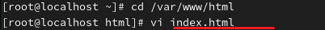
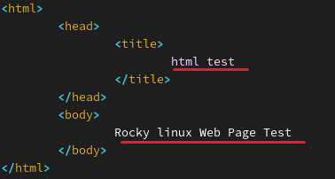
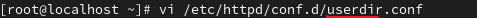
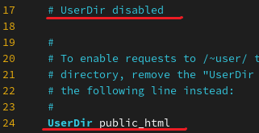
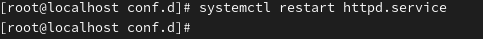
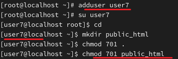
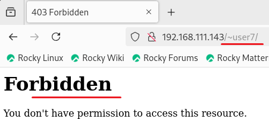
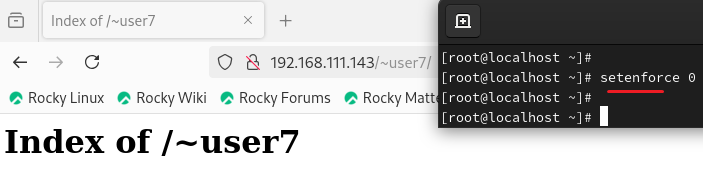

**Apache/Nginx 
 

웹 서버(Web Sever) 
 

 
 
 
아파치의 패키지 이름은 httpd입니다. 

 
 

 
 
아파치를 활성화합니다. 

 
 

 

방화벽을 허용합니다. 

 
 

 
 
 
웹 서버의 기본 디렉터리는 /var/www/html/입니다. 

 
 

 
 
각각 제목과 내용의 위치입니다. 

 
 

 

 
 

 
 
 
 
 
 
 
 
 
 
 
 
 
 
 
 
 
 
 

/etc/httpd/conf/httpd.conf
httpd 서버 기본 설정 파일
 
 
 
 

아파치 사용자 계정 설정 파일
/etc/httpd/conf.d/userdir.conf
 

#    UserDir disabled
UserDir public_html
 
**chmod 701 .(현재 디렉터리)

chmod 701 public_html

