**Mysql/MariaDB 
 

* 목적 : 데이터를 체계적으로 저장 및 보호를 하기 위함 

MariaDB 서버의 패키지 이름은 mariadb-server입니다. 

 
 
 

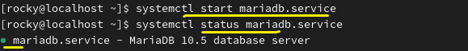 
 
MariaDB를 활성화합니다. 
 
 
 

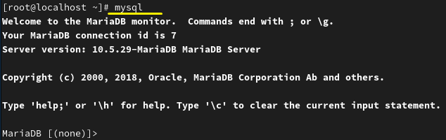 

mysql로 MariqDB를 사용합니다. 
 
 
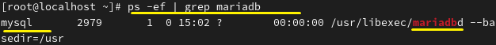 
 
*Why - MariaDB 데몬의 소유자 이름이 Mysql로 높은 호환성을 유지하여 운용이 가능합니다. 
 
 
 

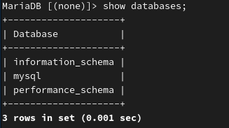 
 
MariaDB에는 기본적으로 세 개의 데이터베이스가 있습니다. 
 

 
 
데이터베이스를 하나 더 만들겠습니다. 
해당 DB에 테이블 만드는 작업을 하려면 use명령으로 지정해야 합니다. 
 

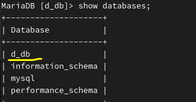 
 
DB가 생성되었습니다.
 
 
 
 
 

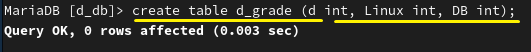 
 

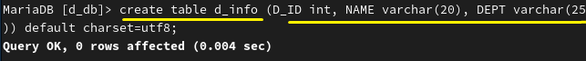 
 
d_grade, d_info라는 테이블에 각 항목을 지정합니다. varchar는 변수가 자료형이며 숫자는 최대 길이입니다.
 
 
 

 

테이블의 구조입니다. 각 행마다 고유성을 가져 키를 보유해야 합니다. 

 
 
 
 

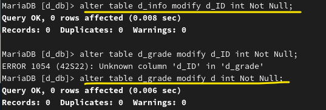 

 
 

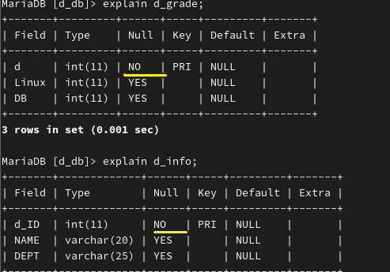 

 
 

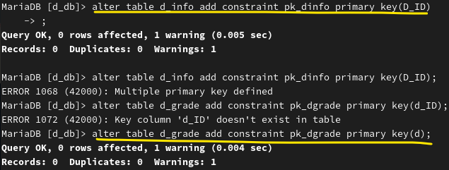 

 
 

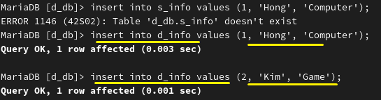 

 
 

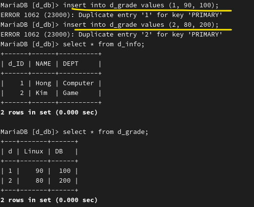 

 
dnf -y install mariadb-server
 
systemctl --now enable mariadb
 
mysql
 
