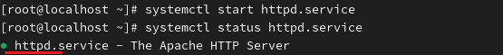
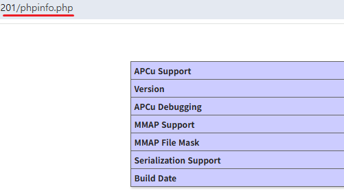

**PHP 
 
It is used to construct web pages using a web programming language. 
웹 프로그래밍 언어로 웹 페이지를 구성하는데 사용합니다. 
 

 

 
There are many PHP packages. All PHP packages can be installed using * 
However, this can be time-inefficient, especially regarding memory usage. 
php 관련 패키지가 많습니다. *이용해 php 모든 패키지를 설치할 수 있습니다. 
하지만, 메모리 사용 등, 시간적으로 비효율적일 수 있습니다. 
 
 
 

 
Only what is necessary for the web server and the database to be linked will be installed. 
웹 서버와 데이터베이스가 연동되도록 하는 데 필요한 것만 설치하겠습니다. 
 
 
 

 
It is written in the web server's default directory, instructing the PHP engine to output all its current information. 
웹 서버 기본디렉토리에 작성하는데, php 엔진에게 현재 모든 정보를 출력하도록 지시합니다. 
 
 
 

 
When searching for IP_address/phpinfo.php, a web page is displayed. 
This indicates that PHP is functioning correctly in the web environment. 
IP주소/phpinfo.php를 검색하면 웹 페이지가 나옵니다. 
이를 통해 php가 웹 환경에서 정상 작동하고 있음을 알 수 있습니다. 
