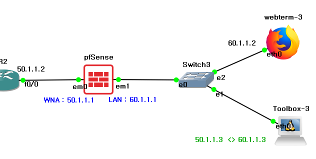
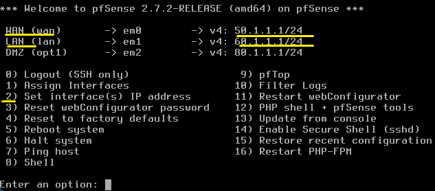

**pfSense 
 

오픈 소스 방화벽 및 라우터 솔루션 
 
 

(GNS3)

 

가운데 pfSense 방화벽이 있고, 방화벽 기준으로 WAN과 LAN으로 나뉩니다. 
오른쪽 ToolBox는 내부에서는 60.1.1.3을 사용하지만, 외부에선 50.1.1.3으로 보입니다. 

*Why-방화벽의 원칙으로 외부에서 들어오는 트래픽은 기본적으로 전부 차단합니다. 
 
 
 

 
 
방화벽을 누르면 설정 화면이 이렇게 나옵니다. 
2을 선택해 DHCP를 통한 IP 자동 할당 또는 IP 수동 설정이 가능합니다. 
