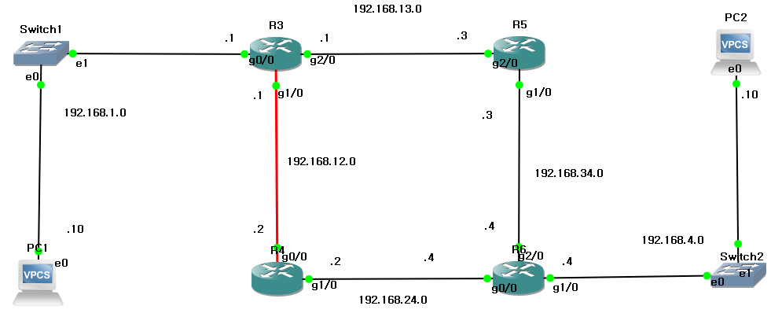
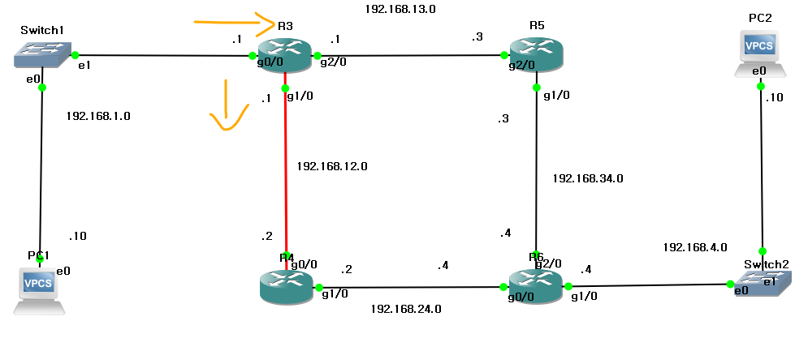
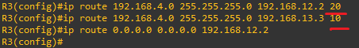
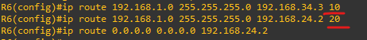

*AD (Administrative Distance)
 

Primary and Secondary Paths
 
 

 

 
 

(GNS3)

 
The connection between PC1 and PC2 is the goal. 
PC1과 PC2의 연결이 목적입니다. 
 
 
 

 
In this situation, two alternative paths are presented. 
The path to be taken can be specified by designating a primary line and a secondary line. 
이때, 이렇게 갈림길이 두 개가 나옵니다 
기본 회선, 보조 회선을 정해 어느 경로로 갈지 지정할 수 있습니다. 
 
 
 
 

 
Priority AssignmentPriorities can be assigned using numerical values, such as 10,20 The lower number(10) designates the primary route. 
20 10과 같은 숫자로 우선 순위를 지정할 수 있습니다. 더 낮은 숫자 10이 우선 경로입니다. 

 

반대도 같습니다. 

