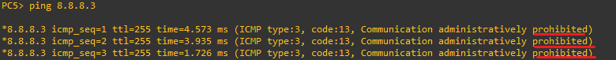

**ACL (Access-Control-List) 
 
 
 
방화벽처럼 라우터 또는 스위치에서 트래픽을 허용 및 차단하는 기능입니다.

(GNS3)

 
 
 
* 8.8.8.1의 호스트만 트래픽 차단하는 과정입니다.
 
 
 
 

 

access-list는 ACL의 목록입니다. 8.8.8.1 주소를 차단 후 제외한 호스트는 전부 허용합니다. 

*Why-방화벽처럼 허용규칙을 명시하지 않으면 묵시적으로 차단합니다. 
 
 

 
 
8.8.8.2과 IP레벨에서 연결 가능합니다. 

 
 
ACL 규칙으로 ICMP 트래픽이 차단되어 연결이 불가능합니다.

 

