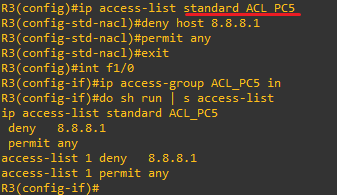
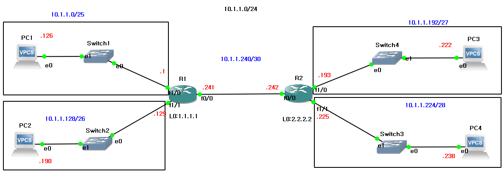
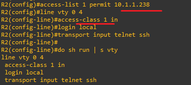

**ACL (Access-Control-List) 
 
 
 
This functionality, similar to a firewall, is the ability to permit and deny traffic on a router or a switch. 
방화벽처럼 라우터 또는 스위치에서 트래픽을 허용 및 차단하는 기능입니다.

(GNS3)

 
 
 
This is the process of blocking traffic only from the host 8.8.8.1. 
* 8.8.8.1의 호스트만 트래픽 차단하는 과정입니다. 
 
 
1.번호 기반(Numbered-based) 
 
 
 
 
 

 

Access-lists are the list of ACLs. The process is to block the 8.8.8.1 address, and then permit all hosts except that one. 
access-list는 ACL의 목록입니다. 8.8.8.1 주소를 차단 후 제외한 호스트는 전부 허용합니다. 
*Why - Similar to a firewall, if a permit rule is not explicitly stated, traffic is implicitly denied. 
*Why-방화벽처럼 허용규칙을 명시하지 않으면 묵시적으로 차단합니다. 
 
 

 
 
connectivity with 8.8.8.2 is possible at the IP level. 
8.8.8.2과 IP레벨에서 연결 가능합니다. 

 
 
Connectivity is impossible because ICMP traffic has been blocked by an ACL rule. 
ACL 규칙으로 ICMP 트래픽이 차단되어 연결이 불가능합니다.
 
 

2.이름 기반(Name-based) 
 
 

 
 
 
 
This is a diagram of the 10.1.1.0/24 network subnetted according to the number of hosts required. 
10.1.1.0/24 네트워크를 호스트 수에 맞게 서브네팅된 도식입니다. 

 

 
 
 

 
ACL configuration is possible for remote access services like Telnet and SSH 
but in this case, the term "class" is used instead of "group." 
telnet,SSH같은 원격 접속도 ACL 설정이 가능한데, 이 경우는 group이 아닌 class가 사용됩니다. 

