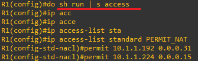
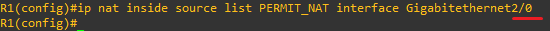

**Wildcard Mask & Applications 
 

 
 
 
* C영역만 NAT 대상일 경우 
이때, 네트워크 전체를 지정이므로 와일드카드 마스크가 필수입니다. 
 

와일드카드 마스크의 계산은 항상 해당 네트워크에서 서브넷 마스크를 빼서 구해야합니다. 
앞에는 해당 네트워크 뒤에는 255에서 서브넷마스크를 빼서 31이 됩니다. 
 

 

 
 
 
 

* D의 Webterm만 외부망 가능하게 설정 
D영역 전체를 대상으로 한 후,
 
 

 

ACL을 NAT쪽 인터페이스로 허용합니다.

 
 

* Webterm에서 R1으로 Http를 이용한 접속 허용 설정

 

서버 기능 활성화하고 인증 방식을 설정합니다. 
http는 tcp기반으로 80번포트를 허용합니다. 

 
 

* R1에서 R2로 telnet과 ssh를 차단하고, icmp를 허용하되, ip를 차단 설정 

 

10 15 같은 앞에 번호는 resequence로 acl 규칙 적용 순서를 나타냅니다.

 
 

*tcp/udp사용하는 DNS관련 포트는 차단하고 이외 허용 설정

 

 
 

 

 
 

 

 
 

 

 

