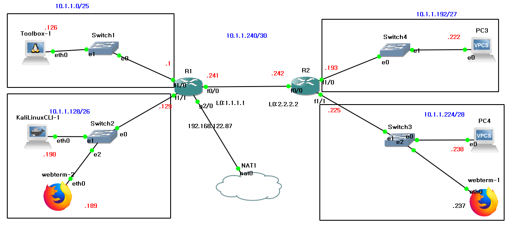
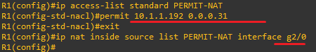
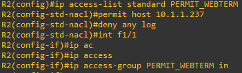
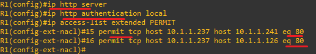
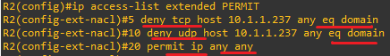
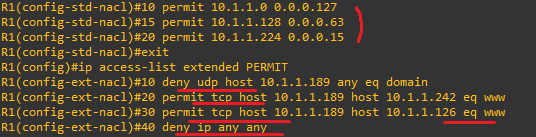
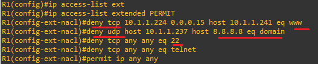

**Wildcard Mask & Applications 
 

 
 
 
* If only Area C is the NAT target, the wildcard mask is essential because the entire network is specified. 
* C영역만 NAT 대상일 경우 
이때, 네트워크 전체를 지정이므로 와일드카드 마스크가 필수입니다. 
 
The calculation of a wildcard mask is always done by subtracting the subnet mask from the corresponding network. 
The value is obtained by subtracting the subnet mask from 255, resulting in 31. 
와일드카드 마스크의 계산은 항상 해당 네트워크에서 서브넷 마스크를 빼서 구해야합니다. 
앞에는 해당 네트워크 주소이고 뒤에는 255에서 서브넷마스크를 빼서 31이 됩니다. 
 

 

 
 
 
 

* Configure only the Webterm in zone D to allow access to the external network. 
* D의 Webterm만 외부망 가능하게 설정 

 
 

 
After applying it to the entire D zone, permit the ACL on the NAT-side interface. 
D영역 전체를 대상으로 한 후, ACL을 NAT쪽 인터페이스로 허용합니다.
 
 
 
 

 
 

* Configure to allow HTTP access from Webterm to R1.
* Webterm에서 R1으로 Http를 이용한 접속 허용 설정

 
 

 

Enable the server function and configure the authentication method. 
HTTP operates on TCP and allows port 80. 
서버 기능 활성화하고 인증 방식을 설정합니다. 
http는 tcp기반으로 80번포트를 허용합니다. 

 
 

* On R1, block Telnet and SSH access to R2, allow ICMP, but deny IP traffic. 
* R1에서 R2로 telnet과 ssh를 차단하고, icmp를 허용하되, ip를 차단 설정 
 
 

 
Numbers such as 10 and 15 indicate the sequence order of ACL rules, which can be adjusted using the resequence command. 
10 15 같은 앞에 번호는 resequence로 acl 규칙 적용 순서를 나타냅니다. 

 
 
 
 
 
 
 
 
 
 

* Block DNS-related ports that use TCP and UDP, and allow IP traffic. 
* tcp/udp사용하는 DNS관련 포트는 차단하고 ip 허용 설정 
 
 

 

 
 

* Block DNS-related packets originating from the left Webterm. 
* Allow HTTP packets from the left Webterm destined for R2. 
* Allow HTTP packets from the left Webterm destined for Toolbox. 
* Deny all other traffic. 
* 좌측 Webterm에서 출발하는 dns 관련 패킷은 차단 
* 좌측 Webterm에서 출발하는 R2를 대상으로 하는 HTTP 패킷은 허용 
* 좌측 Webterm에서 출발하는 Toolbox를 대상으로 하는 HTTP 패킷은 허용 
* 나머지는 모두 차단 
 
 

 

 
 

 
 

* Block HTTP, DNS, Telnet, and SSH traffic from D to R1, and allow other IP traffic. 
* D에서 R1으로 오는 http, dns, telnet, ssh차단 및 ip허용 설정 
 
 

 
80 or www are recognized as the same service. 
DNS is indicated by the domain. 
80 또는 www는 같은 서비스로 인식합니다. 
dns는 domain으로 표시합니다. 

