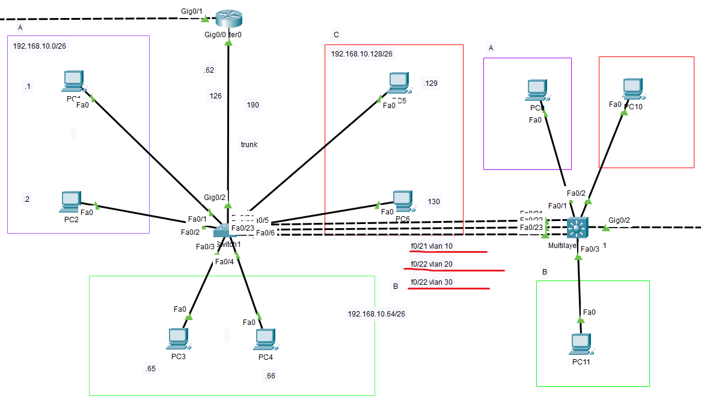
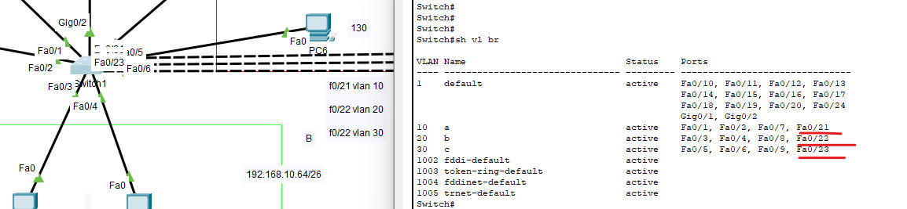
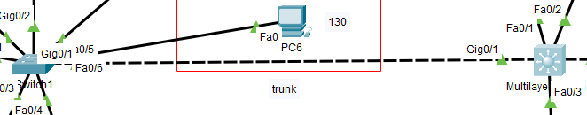
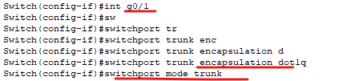

*trunk
 
 
한 개의 케이블에 여러 개의 가상 링크로 데이터를 전송하는 기능
 
 
 
 
(GNS3)

 

vlan10, 20, 30을 이용해 양쪽의 통신을 위한 도식입니다. 

 
 
 
 
 
 

 
 
각각의 인터페이스가 Vlan에 속해있습니다.  
 
 
 
 
 
 

 

가상의 개별적인 링크이지만 이를 편리하게 하나의 가상의 링크로 만들 수 있습니다. 
 
 
 
 
 
 

 
 
각각 인터페이스에 트렁크 모드를 적용시켜야 하며, 이때 캡슐화를 먼저 적용해야 합니다.
 
 
 

