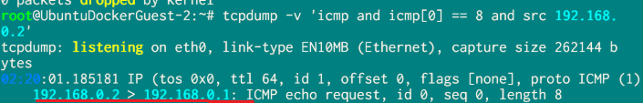

*trunk
 
 
The ability to transmit data over a single cable using multiple virtual links. 
한 개의 케이블에 여러 개의 가상 링크로 데이터를 전송하는 기능
 
 
 
 
(Packer Tracer)

 
A diagram for communication between both sides using VLANs 10, 20, and 30. 
vlan10, 20, 30을 이용해 양쪽의 통신을 위한 도식입니다. 

 
 
 
 
 
 

 
Each interface belongs to a VLAN. 
각각의 인터페이스가 Vlan에 속해있습니다.  
 
 
 
 
 
 

 
Although the links are individual virtual links, they can be conveniently combined into a single virtual link. 
가상의 개별적인 링크이지만 이를 편리하게 하나의 가상의 링크로 만들 수 있습니다. 
 
 
 
 

 
Trunk mode must be applied to each interface, and encapsulation must be configured first. 
각각 인터페이스에 트렁크 모드를 적용시켜야 하며, 이때 캡슐화를 먼저 적용해야 합니다.
 
 
 
 
 
 
 
 

**VLAN Double Tagging - Attack
 
 
 
(GNS3)

 
Only traffic belonging to VLAN 10 can communicate between Switch 4 and Ubuntu. Traffic from VLAN 20, such as from Kali, cannot reach Ubuntu. 
However, packets can be delivered to Ubuntu through double tagging. 
스위치4와 우분투 사이에서 vlan10 소속 트래픽만 통신할 수 있습니다. vlan20 소속 트래픽인 칼리에서는 우분투로 패킷을 전달할 수 없습니다. 
하지만, 이중 태깅을 통해 우분투까지 패킷을 전달할 수 있습니다. 
 
 
pkt = Ether() / Dot1Q(vlan=20) / Dot1Q(vlan=10) / IP(dst='192.168.0.1') / ICMP() 
sendp(pkt,iface='etho0 
이렇게 vlan20을 지정하면서 바깥 쪽 태그를 벗겨낸 후 vlan 10으로 패킷 도달이 성공합니다. 
By specifying VLAN 20 and stripping the outer tag, the packet successfully reaches VLAN 10 
 
 

 
Packets from 192.168.0.2 have reached Ubuntu. 
192.168.0.2로부터 우분투에 패킷이 도달했습니다.
