**RIP

 
 
Distance Vector method in dynamic routing.
 

동적 라우팅 중 거리 벡터(Distance Vector) 방식
 
 
 
 
 
 
 
(GNS3)

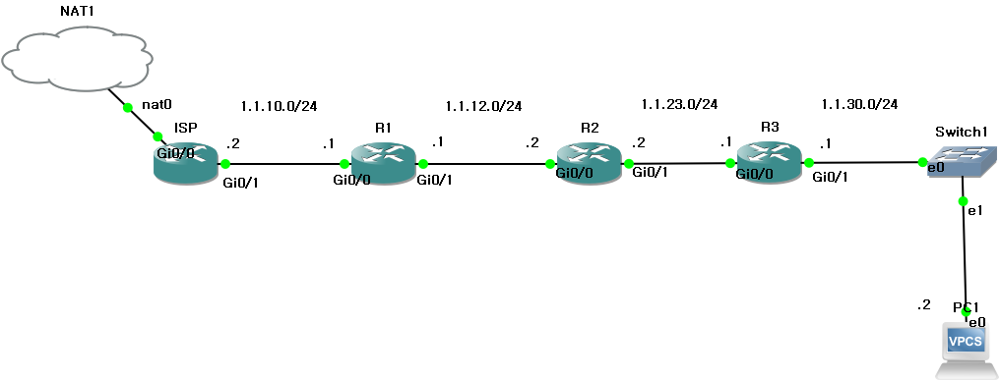 

 

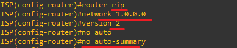 

네트워크 주소(Network address) 
1.1.10.0 
1.1.12.0 
1.1.23.0 
1.1.30.0 

4개 모두 써야하지만, network 1.0.0.0으로 설정 후, 
version 2와 no auto-summary를 이용해 1.x.x.x에 속하는 모든 인터페이스를 한 번에 지정해 RIP 프로토콜을 활성화합니다. 

All four must be used, but after setting the network to 1.0.0.0, 
use version 2 and no auto-summary to enable the RIP protocol on all interfaces belonging to the 1.x.x.x range at once. 
 

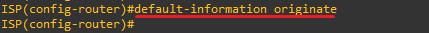 
If a 0.0.0.0/0 default route to the outside is configured on the ISP, default-information originate propagates it to the connected routers. 
default-information originate는 ISP에 외부로 나가는 0.0.0.0/0 기본 경로가 설정되어 있다면 연결된 다른 라우터에 전파합니다.

 
 
 
 
 
 
 

**distribute-list
 
 
Operates with ACLs and prefixes to filter paths. 
ACL과 Prefix로 작동하여 경로를 필터링합니다.
 
 
 
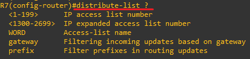 

 
 
 
 
(GNS3)

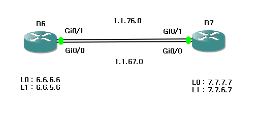 
Configure dynamic routing according to the network. Do the same on R6 
네트워크에 맞게 동적 라우팅 설정을 합니다. R6에도 똑같이 합니다. 
 

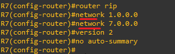 
 
 

* R7에서 나가는 모든 RIP 네트워크 정보를 차단할 경우 (In the case where all RIP network information leaving R7 is blocked)
 
 
 

 
There are ACLs and prefix-lists under the distribute-list. 
distribute-list 아래 ACL과 prefix-list가 있습니다.

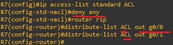 
Apply an ACL with ‘deny any’ 
deny any를 적용한 ACL을 적용합니다.

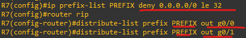 
Since le means ‘less than or equal to 32’, the prefix 0.0.0.0/0 le 32 represents the entire network range. 
le는 32 이하를 말하므로, prefix에서 0.0.0.0/0 le 32 모든 네트워크 범위를 말합니다.

 
 
 
 
 

* R7에서 나가는 L0(7.7.7.0/24)만 차단할 경우 (In the case where only L0 (7.7.7.0/24) leaving R7 is blocked)
 
 
Both ACLs and prefix-lists will be used. 
ACL,Prefix 모두 사용하겠습니다.
 
 
 

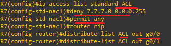 
Set up the ACL first, representing 7.7.7.0/24 as 7.7.7.0 with a wildcard mask of 0.0.0.255. 
ACL 먼저 설정하는데, 7.7.7.0/24를 7.7.7.0 와일드마스크 0.0.0.255로 표현합니다.

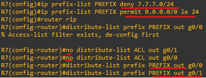 
When only 7.7.7.0/24 is blocked, the rest must be allowed due to the implicit deny. 
7.7.7.0/24만 차단일 경우 묵시적인 차단 때문에 나머지는 허용해야 합니다.
 
 
 
 

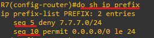 
When viewing prefixes, a sequence number is shown; lower sequence numbers indicate higher priority in application. 
prefix를 조회하면 seq 숫자가 나오는데, sequence 낮을 수록 우선 적용되는 순서를 나타냅니다.
 
 
 

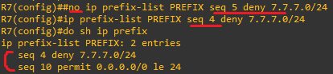 

 
Priority can be set by assigning numbers. 
숫자를 적용해 우선순위를 설정할 수 있습니다.
 
 

* R6에서 나가는 L1(6.6.5.0/24)만 허용할 경우 (In the case where only L1 (6.6.5.0/24) leaving R6 is allowed)

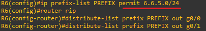 

There is an implicit deny rule at the end after the specified rules are applied, so only allow rules need to be configured. 
명시된 규칙들이 적용된 후 마지막에 묵시적 거부 규칙이 있습니다. 그래서 허용만 설정하면 됩니다. 

 
 
 
 
 

 
 
**offset-list
 
 
 
 

To control traffic flow by changing the priority of a specific route. 
특정 경로의 우선순위를 변경하여 트래픽의 흐름 제어
 

 
Let interface g0/0 be the primary line and g0/1 be the backup line. 
인터페이스 g0/0이 주회선 g0/1이 보조회선이라고 하겠습니다. 
 
 
 

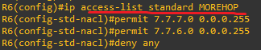 
On R6, the address of R7 is permitted, and on R7, the address of R6 is permitted. 
R6에서는 R7, R7에서는 R6의 주소를 허용합니다.  
 

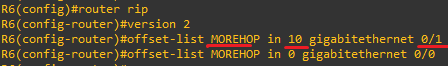 
The pre-created list MOREHOP is applied to the offset-list to assign priority. 
The lower the number, the higher the priority.Since g0/0 has the lower value, it becomes the primary line. 
미리 만든 리스트 MOREHOP을 offset-list에 적용시켜 우선 순위를 부여합니다. 
숫자가 낮을 수록 우선순위가 됩니다. 숫자가 낮은 g0/0이 주회선이 됩니다. 

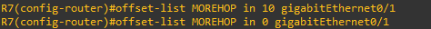 
The same configuration is applied to R7 as well. 
R7에도 똑같이 적용합니다. 

