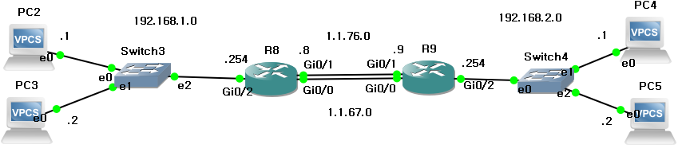
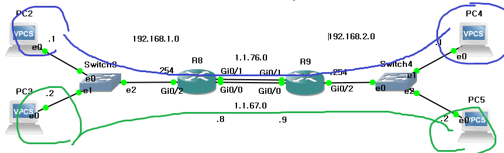
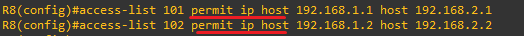
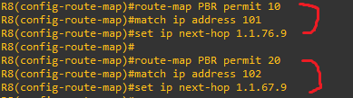
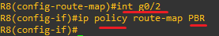

**PBR (Policy Based Routing)
 
 
 
Policy-based routing is applied with the highest priority within the conditions defined for PBR. 
정책 기반 라우팅으로 (설정한 PBR 조건 안에서) 가장 우선적으로 적용되는 기능입니다. 
 
 
라우팅 적용 순위(Priority of routing application) 

1.정책 라우팅(Policy routing) 
2.정적 라우팅(Static routing) 
3.동적 라우팅(Dynamic routing) 
 

 
 

 
 
 
(GNS3)
 
 
 

 

라우터 사이의 회선이 두 개가 있습니다. 

 
 
 

 
Using PBR, blue traffic will be routed through the upper blue link, and green traffic will be routed through the lower green link, respectively. 
PBR을 이용해 파란색은 파란색끼리 초록색은 초록색끼리 각각 위,아래 회선으로 연결하겠습니다.

 
 
 

 

 
 
 

 

 
 
 

 

 
 
 
 
 
 
 
 
 
 
 
 
 
 
 

**Redistribution
 
 
*Why-each routing process has a different table, the routes must be redistributed in a form suitable for the specific routing protocol. 
*Why-라우터마다 테이블,프로토콜이 다르기 때문에, 특정 라우팅 프로토콜에 맞게 다시 전달하는 것 
