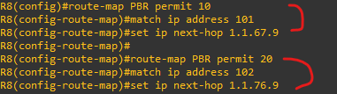

**PBR

 
 

 
 
 
(GNS3)

 

 
 
 

 

 
 
 

 

 
 
 

 

 
 
 

 
 
 
 
 
 
 
 
 
 
 
 
 
 
 

**Redistribution
 
 
*Why-each routing process has a different table, the routes must be redistributed in a form suitable for the specific routing protocol. 
*Why-라우터마다 테이블,프로토콜이 다르기 때문에, 특정 라우팅 프로토콜에 맞게 다시 전달하는 것 
