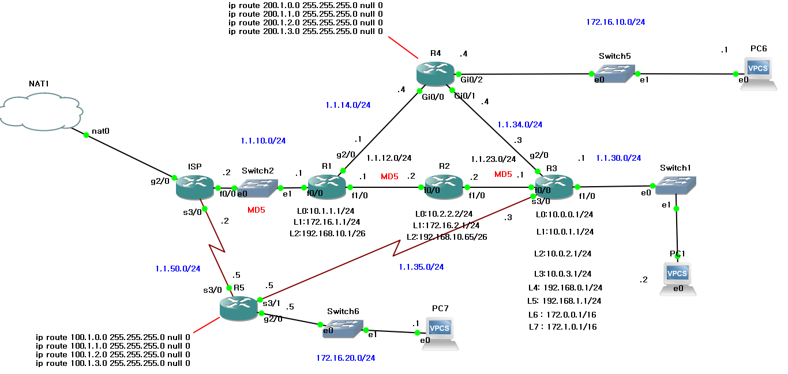
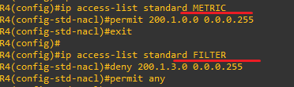
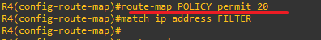
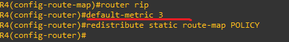

**PBR (Policy Based Routing)
 
 
 
Policy-based routing is applied with the highest priority within the conditions defined for PBR. 
정책 기반 라우팅으로 (설정한 PBR 조건 안에서) 가장 우선적으로 적용되는 기능입니다. 
 
 
라우팅 적용 순위(Priority of routing application) 

1.정책 라우팅(Policy routing) 
2.정적 라우팅(Static routing) 
3.동적 라우팅(Dynamic routing) 
 

 
 

 
 
 
(GNS3)
 
 
 

 
There are two links between the routers. 
라우터 사이의 회선이 두 개가 있습니다.  

 
 
 

 
Using PBR, blue traffic will be routed through the upper blue link, and green traffic will be routed through the lower green link, respectively. 
PBR을 이용해 파란색은 파란색끼리 초록색은 초록색끼리 각각 위,아래 회선으로 연결하겠습니다.

 
 
 

 
Communication is allowed among the upper group and among the lower group. 
위쪽은 위쪽끼리 아래쪽은 아래쪽끼리의 통신을 허용합니다. 

 
 
 

 

Routing policies are defined by PBR using route-maps. The number next to ‘permit’ determines the priority as a sequence. 
An ACL number is specified in ‘match ip address,’ and a preferred next-hop IP is designated. 
PBR은 router-map으로 경로 정책을 정의합니다. permit 옆의 숫자는 시퀀스로 우선 순위를 정합니다. 
match ip address ACL 번호를 지정하고, 다음 경로로 향하는 우선 ip를 지정합니다. 

 
 
 

 
The PBR policy is applied to the router interface that is divided into two links. 
회선 두개로 나뉘는 라우터 인터페이스에 만든 PBR 정책을 적용합니다.

 
 
 
 
 
 
 
 
 
 
 
 
 
 
 

**Redistribution
 
 
*Why-each routing process has a different table, the routes must be redistributed in a form suitable for the specific routing protocol. 
*Why-라우터마다 테이블,프로토콜이 다르기 때문에, 특정 라우팅 프로토콜에 맞게 다시 전달하는 것 
 
 
 
 
 
 
 
 

(GNS3)

 
the router at the top (R4) is considered. Before performing redistribution, a virtual address that does not exist in the network is created and discarded to Null 0. 
WHY – A false route is created and advertised externally to prevent routing loops. 
맨 위 쪽의 라우터(R4)만 보겠습니다. 재분배를 수행하기 전에 네트워크에 존재하지 않는 가상의 주소를 생성하고 NUll 0 으로 폐기합니다. 
*WHY - 경로를 거짓으로 생성해 외부에 광고를 하며, 루프를 방지합니다. 
 
 
 
* 200.1.0.0/24의 메트릭만 10으로 설정 
* 200.1.3.0/24만 재분배에서 제외 
* 기타 기본 재분배 메트릭은 3으로 설정 

 
Two ACLs are created to permit and deny traffic according to the conditions. 
조건에 맞게 허용 및 차단하는 ACL 두 개를 만듭니다. 
 
 

 
A metric of 10 is set on the first list. 
첫 번째 리스트에 매트릭 10을 설정합니다. 
 
 

 
The list is applied to the redistribution. 
재분배에 리스트를 적용합니다. 
 
 

 
The default metric is set to 3 and applied to 1 and 2 
기본 매트릭을 3으로 설정 후, 1번과 2번에 적용합니다.

